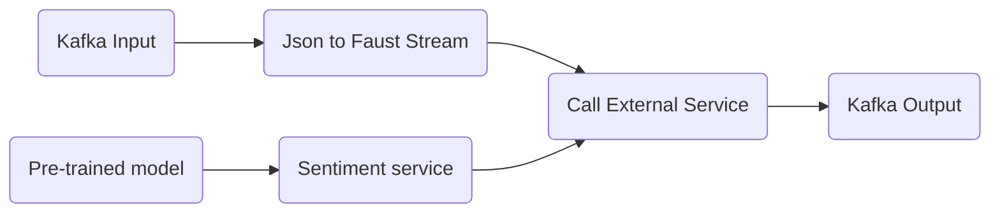

# Real time Predictions:
## Use Case
### Input Kafka topic: real time user reviews
### Data format: json
`
{
    'review_id': "10000",
    'content': "Movie was perfectly balanced with emotion,fun and entertainment"
}
`
### Goals:
- Use an HTTP service to predict sentiment of each review and publish the sentiments to an outgoing topic

## Design

## Implementation
1. Producer service: generate movie reviews json data randomly and publish to kafka input
2. Consumer service: 
* consume stream data
* call external sentiment service for each review and publish the result to kafka
3. Kafka cluster
4. Kafdrop tool for viewing messing in kafka
5. Sentiment Service using Flask and vaderSentiment

## Testing
- Assuming we are running docker service
- Open terminal and change to project folder
- Run this command to start services

`
docker-compose -f docker_compose.yml up
`
- That above command will start kafka cluster, kafkrop, producer, customer
- We can view product_summary using http://localhost:9000
- There are other useful commands to work with this project

`
docker-compose -f docker_compose.yml down
`

`
docker-compose -f docker_compose.yml build
`

## References
- https://faust-streaming.github.io/faust/playbooks/vskafka.html
- https://github.com/faust-streaming/faust
- https://www.geeksforgeeks.org/python-sentiment-analysis-using-vader/